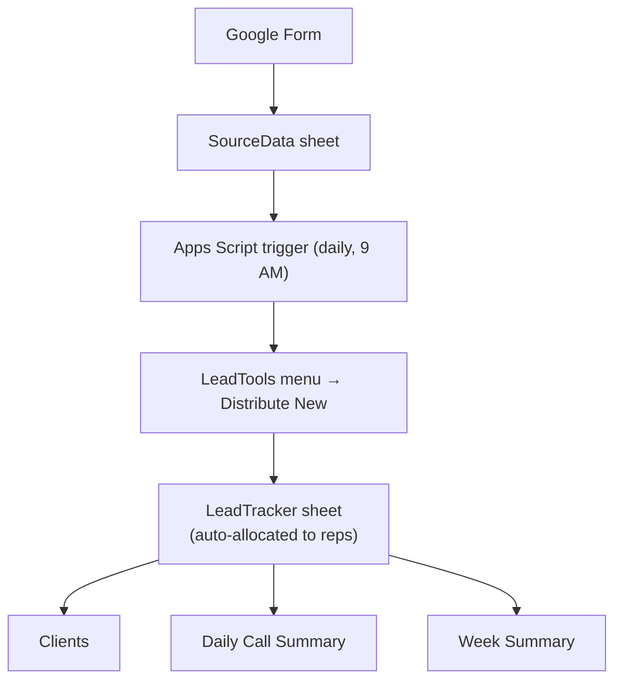

# Automated-Lead-Distribution-and-CRM-Pipeline
Automated lead distribution and CRM pipeline built on Google Sheets + Apps Script, processing inbound ad-campaign leads and auto-assigning them to a sales team

# Lead Tracker Automation

Automated lead ingestion, distribution, and reporting pipeline built entirely on **Google Sheets + Google Apps Script**. Inbound leads from Google Ads campaigns (captured via a Google Form) are pulled in daily, distributed to a sales team through a custom menu tool, and rolled up into live client, daily, and weekly reporting — with zero manual data entry.

## What it does

- **Ingests** new leads from a Google Form response sheet on a daily schedule (9 AM trigger)
- **Distributes** unallocated leads to sales/call reps via a custom `LeadTools → Distribute New` menu action
- **Tracks** up to 10 rounds of follow-up calls per lead (status, quality, remarks, date) without needing a separate CRM
- **Reports** automatically: a live `Clients` sheet for converted leads, a `Daily Call Summary`, and a `Week Summary` — all formula-driven off the master tracker

## Architecture



See [`docs/architecture.md`](docs/architecture.md) for a full breakdown of each stage.

## Key design points

- **Multi-attempt call tracking** — each lead carries 10 repeated blocks of `Call Status / Lead Quality / Remark / Date`, so a rep's entire follow-up history lives on one row instead of a separate call log.
- **Formula-driven reporting** — `Clients`, `Daily Call Summary`, and `Week Summary` are populated with `QUERY`, `UNIQUE`, and `COUNTIFS` formulas against `LeadTracker`, not scripts, so they update live as reps update call statuses.
- **Idempotent ingestion** — the daily trigger only pulls rows newer than the last synced row, so re-running it never duplicates leads.

## Tech stack

- Google Sheets (data store + UI)
- Google Apps Script (`clasp`-managed, see `src/`)
- Google Forms (lead capture)

## Setup

See [`docs/setup-guide.md`](docs/setup-guide.md) for step-by-step deployment instructions, including how to point this at your own Form, Sheet, and script properties.

## Repo structure

```
lead-tracker-automation/
├── src/                  # Apps Script source (managed via clasp)
│   ├── triggers/          # daily fetch job
│   ├── distribution/      # Distribute New logic
│   ├── menu/               # LeadTools custom menu
│   └── utils/               # shared helpers
├── schema/
│   └── sheet-schema.md    # full column reference for every sheet
├── docs/
│   ├── architecture.md    # detailed pipeline walkthrough
│   └── setup-guide.md     # deployment instructions
└── demo-data/
    └── sample_leads.csv   # fabricated sample rows for local testing
```

