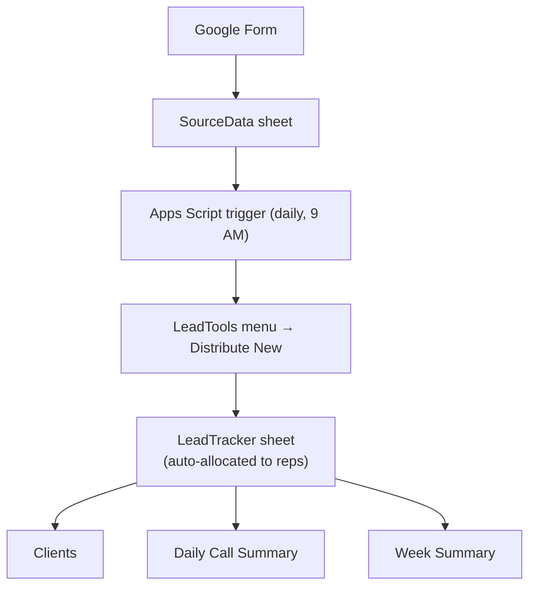

# Architecture

## Overview

## Stage by stage

### 1. Lead capture — Google Form
Ad campaigns link to a Google Form. Every submission (name, phone, shoot duration, content type, editing-services interest) lands in the Form's linked response sheet.

### 2. Ingestion — `SourceData`
`SourceData` mirrors the raw Form responses: `Date`, `Full Name`, `Phone Number`, `Per Hr Shoot`, `Content You Are Planning`, `Do You Need Editing Services`. This sheet is treated as an append-only landing zone — it is never edited by hand.

### 3. Daily sync trigger
A time-driven Apps Script trigger runs every morning at 9 AM. It:
- Reads `SourceData` for rows added since the last sync
- Skips anything already present (idempotent — safe to re-run)
- Leaves new, unallocated rows ready for distribution

### 4. Distribution — `LeadTools → Distribute New`
A custom menu (built with `onOpen()`) adds a **LeadTools** menu to the Sheet UI. Clicking **Distribute New**:
- Pulls unallocated rows
- Assigns each to a sales/call rep (rotation-based allocation)
- Generates a unique `Lead ID` (e.g. `L0166`)
- Appends the row to `LeadTracker` with `Allocation Date` and `Sales Person` set

### 5. Master tracker — `LeadTracker`
The working sheet reps use daily. Each row supports up to **10 follow-up rounds**, each with its own `Call Status`, `Lead Quality`, `Remark`, and `Date` column group — so a lead's full call history lives on a single row. A `Follow-up Count` formula (`COUNTA` across the status columns) and a `Lead Status` field summarize progress at a glance.

Rep-specific filtered views (e.g. `Karan_Leads`) and a `Not Call Picked Leads` view are maintained off the same master data for individual reps to work from.

### 6. Reporting — formula-driven, not script-driven
- **`Clients`** — pulls unique converted leads from `LeadTracker` via `QUERY`/`UNIQUE`, filtered on `Lead Status = Converted`.
- **`Daily Call Summary`** — `COUNTIFS` against `LeadTracker`'s allocation and call-date columns, keyed off a date cell the user sets.
- **`Week Summary`** — aggregate conversion-rate and follow-up metrics over a user-defined date range.

Because these are live formulas rather than scripted exports, they update immediately as reps log calls — no separate "generate report" step.

## Why this design

- **No external database** — Sheets + Apps Script is sufficient for this volume and keeps the whole team in a tool they already know.
- **Append-only source of truth** — `SourceData` is never mutated, so re-running ingestion is always safe.
- **History on one row** — the repeated call-attempt column blocks trade sheet width for the ability to see a lead's entire journey without cross-referencing a separate call log.
